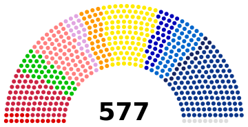

# ParliamentArch-TS

Generation of arch-styled SVG parliamentary diagrams.

This is a TypeScript port of the [ParliamentArch](https://github.com/Gouvernathor/parliamentarch) Python module, itself a spin-off from David Richfield's [ParliamentDiagram](https://github.com/slashme/parliamentdiagram).

You can install it as a [package](https://www.npmjs.com/package/parliamentarch) using `npm install parliamentarch`.

## Base math and layout

The idea is to display a certain number of seats so that they collectively form a hemicycle, which is a half-annulus where the inner radius is also a half of the outer radius. The shape fits in a 2:1 rectangle in a landscape orientation, with the hole of the annulus at the bottom.

The seats are placed in rows, such that:

- The rows are semi-circles, concentric to the annulus.
- The difference between the radii of two consecutive rows is a constant called the "row thickness" (radii is the plural of radius).
- The seats are circles (or disks) of equal diameter. That radius divided by the row thickness is called the "seat radius factor".
- The center of a seat is on the semi-circle the seat's row.
- Within each row, the distance between the centers of two consecutive seats is a constant, at least equal to the row thickness.
- The innermost row's semi-circle is the inner arc of the annulus.
- The radius of the outermost row's semi-circle is equal to the radius of the outer arc minus half of the row thickness, such that no seat may overlap the outer arc.
- The vertical distance between the center of the bottom-most seats of each row, which are the first and last seat of each row, is equal to half of the row thickness, such that no seat may overlap the bottom of the rectangle.
- However, when a row contains only one seat, the previous rule does not apply, and the seat is placed at the horizontal center of the diagram.

As a result of these constraints, there is a maximum number of seats that can be placed in a diagram with a given number of rows. For numbers of seats below this maximum, there exists a number of strategies to distribute the seats among the rows.

It is also possible to change the span angle of the diagram (which is 180° in the example above). If a smaller angle is specified, the initial annulus must be cut along two radii of the larger circle. For seat placements, what applied to the bottom of the rectangle now applies to the two radii.

## Tweakable parameters

As hinted above, some parameters can be set to customize the layout of the diagram:

- The span angle of the hemicycle can be sety to a value lower than 180° (higher values are not supported). However, values so low as to prevent some rows from containing even one seat are not supported, will yield incorrect results, and may throw errors in future versions.
- The number of rows can be set higher than the minimum required to hold the provided number of seats. This will result in smaller seats (more precisely, a smaller row thickness).
- The seat radius factor can be set between 0 and 1, with the seats touching their neighbors when the factor is 1.
- As long as the number of seats is not the maximum number of seats for the given number of rows, different strategies can be chosen to distribute the seats.

## Main module contents

These are found in the `parliamentarch` module.

`SeatData`

This class is defined and explained in the SVG submodule below, but it is also exposed as part of the main module. It stores values about how to draw a given seat (or a group of similar seats).

`getSVGFromAttribution()`

This function creates the diagram as an SVG element which can then be integrated in the DOM. The parameters are as follows:

- `attribution: Map<SeatData, number>`: a mapping from a SeatData object to a number of seats in the diagram. Typically, each SeatData object represents a group or party. The ordering of the elements matter, and the groups will be drawn from left to right in the diagram.
- `seatRadiusFactor: number`: the ratio (between 0 and 1) of the seat radius over the row thickness. Defaults to .8.
- `getSeatsCentersOptions: object` and `getGroupedSVGOptions: object`: parameters passed through to the corresponding options parameters of the getSeatsCenters and groupedSVGOptions functions, respectively.

## Geometry submodule contents

These are found in the `parliamentarch/geometry` module.

`getNRowsFromNSeats(nSeats: number, spanAngle?: number): number`

Returns the minimum number of rows required to hold the given number of seats in a diagram with the given span angle.

`getRowsFromNRows(nRows: number, spanAngle?: number): number[]`

Returns a list of each row's maximum seat capacity, starting from inner to outer, from a given number of rows and span angle. The list is increasing and its length is equal to the number of rows.

`getRowThickness(nRows: number): number`

Returns the row thickness, i.e the difference between the radii of two consecutive rows, for a given number of rows. This can help converting a seat radius factor (as passed to getSVGFromAttribution) to a seat actual radius as taken by the getSVG functions.

`FillingStrategy`

A string enum of the implemented strategies to fill the seats among the rows:

- `DEFAULT`: The seats are distributed proportionally to the maximal number of seats each row can hold. The result is that the lateral distance between the seats is close among all rows.
- `EMPTY_INNER`: This selects as few outermost rows as necessary to hold the given seats, then distributes the seats proportionally among them. Depending on the number of seats and rows, this either leaves empty inner rows, or is equivalent to the `DEFAULT` strategy. This is equivalent to the legacy "dense rows" option, in that in non-empty rows, the distance between consecutive seats is the smallest possible, and is close among all rows.
- `OUTER_PRIORITY`: This fills the rows to their maximal capacity, starting with the outermost rows going in. The result is that given a number of rows, adding one seat makes a change in only one row.

`getSeatsCenters(nSeats: number, options?: object): Map<[number, number], number>`

This is the main function of the submodule. The options are as follows:

- `minNRows?: number`: Sets a minimum number of rows.
- `fillingStrategy?: FillingStrategy`: The strategy to use, defaults to `DEFAULT`.
- `spanAngle?: number`: The span angle of the diagram in degrees, defaults to 180.

The function returns a map representing the ensemble of seats. The keys are `[x, y]` pairs, the cartesian coordinates of the center of the seat. The coordinates start from the bottom-left corner of the rectangle, with the x axis pointing to the right and the y axis pointing up. The outer radius of the annulus, equal to the height and to half of the width of the rectangle, is 1, so `x` goes from 0 to 2 and `y` goes from 0 to 1.

The values are the angle, in radians, calculated from the right-outermost point of the annulus arc, through the center of the annulus, to the center of the seat. Sorting the keys by decreasing value returns the seats arranged from left to right. The order of the entries in the Map is meaningless.

## SVG submodule contents

These are found in the `parliamentarch/svg` module.

`SeatData({color: string, id?: string, data?: string, borderSize?: number, borderColor?: string})`

An interface for data about a seat or a group of seats:

- `color: string`: The color with which to fill the seat circle, as a CSS color.
- `id?: string`: An optional id for the group of seats.
- `data?: string`: An optional text to display when hovering over the seat.
- `borderSize?: number`: The size of the border around the seat circle, defaults to 0.
- `borderColor?: string`: The color of the border, defaults to black.

`getGroupedSVG(seatCentersByGroup: Map<SeatData, [number, number][]>, seatActualRadius: number, options?: object): SVGSVGElement`

This function creates an SVG element containing the diagram. The parameters are as follows:

- `seatCentersByGroup: Map<SeatData, [number, number][]>`: A mapping from the SeatData object of a group of seats to a list of the seat center coordinate pairs. The order of the seat centers is meaningless.
- `seatActualRadius: number`: The actual radius of the seat circles, in the same unit as the coordinates which is a fraction of `canvasSize` (see below).

The options are as follows:

- `canvasSize?: number`: The height of the 2:1 rectangle in which the diagram is drawn, defaults to 175.
- `margins?: number|[number, number]|[number, number, number, number]`: The margins around that rectangle. If 4 values are given, they are the left, top, right and bottom margins in that order. If 2 values are given, they are the horizontal and vertical margins in that order. If only one value is given, it is used for all margins. Defaults to 5.
- `writeNumberOfSeats?: boolean`: Whether to write the number of seats at the bottom center of the diagram - in the well of the house. Defaults to true.
- `fontSizeFactor?: number`: A factor you should tweak to change the font size of the number of seats. The default value is around .2. Keeping this value constant will keep the font size in scale when changing the canvas size.

<!--
TODO

everything called a Map<K, V> here can be replaced with a [K, V][] array
 -->
